# AXI Documentation
## 1. Introduction
Most programmable System on Chip (SoC) devices, such as the Zynq-7000 have architectural features which provide designers with an advanced ARM based Processing System (PS) and a flexible region of Programmable Logic (PL) based on FPGA fabric. The PS and the PL communicate using an interface standard called ARM eXtensible Interface (AXI). Other common SoC interfaces are IBM's Processor Local Bus / On-chip Peripheral Bus (PLB/OPB) interface and Wishbone OpenCore cores. In this document we will focus on the AXI since it is currently used in the CASPER toolflow developments. 
The AXI is part of the Advanced Microntroller Bus Architecture (AMBA) developed by ARM along with the Advanced Peripheral Bus (APB), Advanced High-performance Bus (AHB) and the Advanced Trace Bus (ATB) as shown in Fig. 1 below. The AXI is also the bus of choice for chip maufacturers e.g. Xilinx. The current AXI version, AXI4 (based on AMBA 4.0:2010) has three variants viz; AXI4, AXI4-Stream and AXI4-Lite. The AXI4 is a high performance memory mapped data and address interface capable of burst access to memory maapped devices. The AXI4-Stream is a fast unidirectional protocol for transferring data from master to slave. The AXI4-Lite is a subset of the AXI that lacks the burst access capability. Again we will focus on the AXI4-Lite interface since it is currently finding application in CASPER toolflow developments.

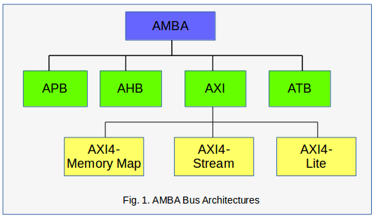

## 2. AXI4-Lite Interface
The AXI4-Lite interface exists between the AXI master and the AXI slave. The AXI master initiates the read and write transactions while the AXI slave responds to the initiated transactions. Fig.2 below illustrates this master - slave transaction concept.

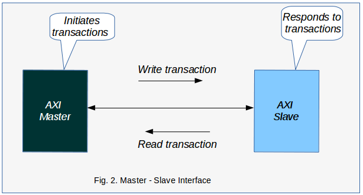

The illustration above is a one master to one slave interface. However, it is quite often that one/several master(s) may want to communicate with one/several slave(s) or vice-versa. In this case, an AXI Interconnect is required to perform the necessary abitration among the communicating master and slave devices. Fig. 3 below illustrates this concept, where there is one master and three slaves.

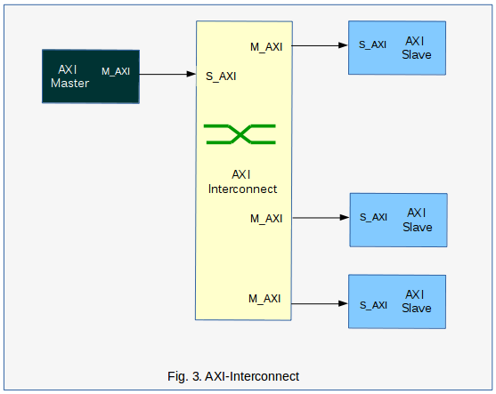

## 3. AXI4-Lite Transactions
The transfer of data between the AXI4-Lite master and slave devices follow a specification which involves five cahannels; the read address channel, the write address channel, the read data channel, the write data channel and the write acknowledge (response) channel. All these five channels are contained in the read and write transactions discussed below.

###  a. Read Transactions
The read transaction is initiated by the master to retrieve values from the slave device. This transaction is completed based on the read address and the read data channels as shown in Fig. 4 below. The read address channel carries the address information and some handshaking signals that allows the master to inititate a read transaction. The read data channel carries the actual data values that are transferred, together with the associated handshaking signals.

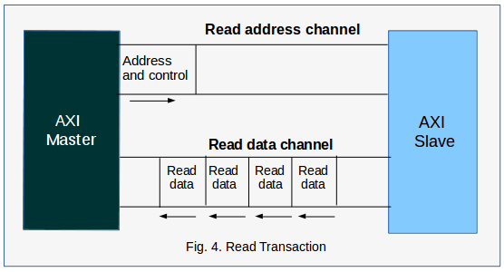

###  b. Write Transactions
The write transaction is initiated by the master to write (store) data values in the slave device. This transaction is completed based on the write address, write data and write response channels as shown in Fig. 5 below. The write address channel carries the address information and some handshaking signals that allows the master to inititate a write transaction. It is identical to the read address channel above. The write data channel carries the actual data values that are to be written, together with the associated handshaking signals. The write response channel allows the slave to acknowledge receipt of data or to signal an error.

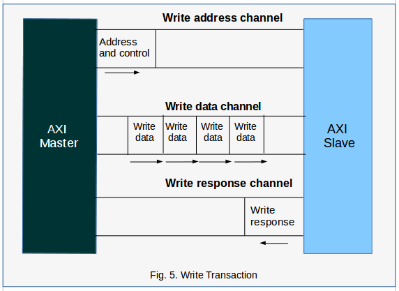

## 4. AXI4-Lite Interface Signals
The AXI4-Lite interface signals and their descriptions are summarised in Table 1 below. The signals are grouped according to the channels as discussed above. By convention, the signals contained within each channel are named with a specific format as follows:

Write address channel - signal names have the format s_axi_aw...
Write data channel - signal names have the format s_axi_w...
Write response channel - signal names have the format s_axi_b...
Read address channel - signal names have the format s_axi_ar...
Read data channel - signal names have the format s_axi_r...

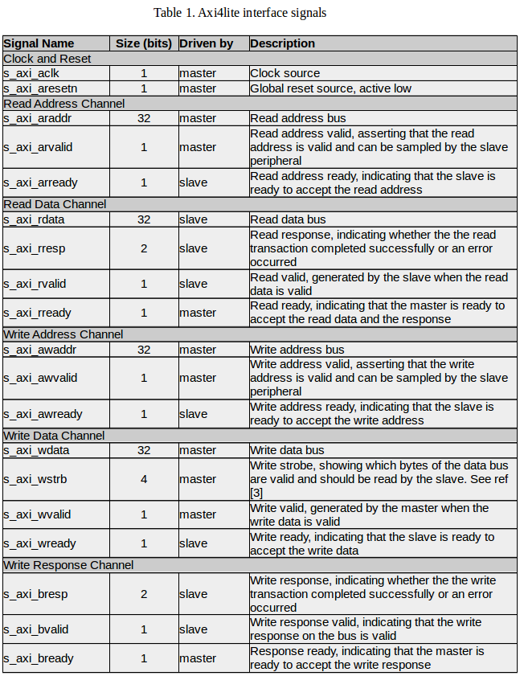

The details of the s_axi_wstrb and s_axi_rresp/s_axi_bresp signals can be found in Table 2 and Table 3 respectively.

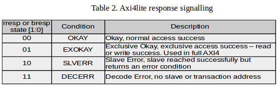

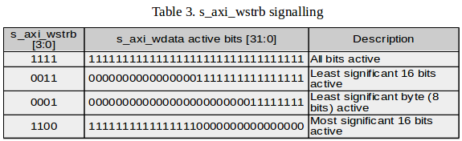

## 5. Custom AXI4-Lite Interface

The CASPER toolflow implements an axi4lite interface and a custom slave implementation that is based on the xml2vhdl code generation. To illustrate this concept we start with an example Simulink design that includes sofware registers (addr, data_in, data_low), BRAM (shared_bram) and a raw axi device (raw_axi_write_enable) as slave devices as shown in Fig 6.

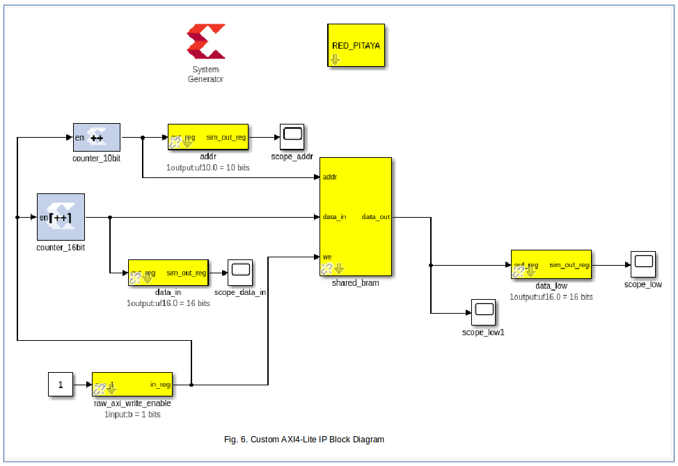

A block diagram of the CASPER custom axi4lite IP which is derived from the Simulink design is shown in Fig.7. The platform instance (eg red_pitaya) instantiates some logic which adapts a software interface (PL <-> PS ports eg DDR_x) which connects to the AXI_interconnect. Four axi4lite slave instances, in this case are arbitered by the AXI_interconnect. These slave instances are sys_block, sw_reg, shared_BRAM and the raw_axi_device as shown in the diagram. The existence of some of these slave instances is dynamic and depends on the Simulink yellow blocks the user instantiates. The sys_block_inst is always there as it is instantiated by the platform python code. The sw_reg_inst is always there but has a different number of outputs depending on how many sw_reg blocks a user instantiates. The bram_inst is not always there but we get one instance for each bram yellow block in the simulink design. The number of raw_axi_device instances depend on how many raw_axi devices a user instantiates.
It is important to note that all of the axi4lite interconnect logic and the xml2vhdl slave generated blocks are dynamically wrapped up in the axi4lite_ic_wrapper and the exposed ports are available at top level to drive or be driven by Simulink or some other logic blocks. An exception to this is the raw_axi_device which must implement its own decoding logic such that it requires only a raw AXI interface.

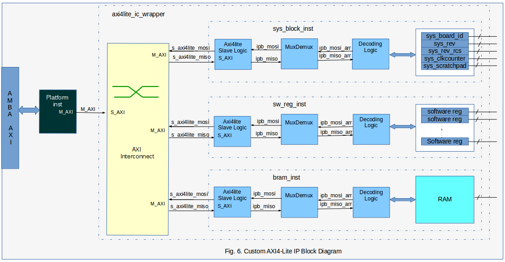

In all cases, the AXI_interconnect connects to the axi4lite slave logic instances through the axi4lite mosi/miso signals. The ipb_mosi/miso signals connects the axi4lite slave logic to the MuxDemux blocks. You will see these signals as ipb_mosi[addr], ipb_mosi[req], ipb_mosi[wdat], ipb_mosi[wreq], ipb_miso[rack], ipb_miso[rdat] and ipb_miso[wack] in the toolflow. The ipb_* string is some convention adopted in the xml2vhdl code. The respective registers or RAM can now be accessed through some decoding logic. It is important to note that the maximum number of slaves on this axi4lite interface is 32.

The creation of an AXI device yellow block follow the general procedure decribed in Yellow Block Tutorial https://casper-toolflow.readthedocs.io/projects/tutorials/en/latest/tutorials/snap/tut_gpio_bidir.html?highlight=Yellow%20Block%20tutorials#yellow-block-tutorial-bidirectional-gpio

Here we will show how the device memory maps and device axi4lite interfaces are created. The device memory map is created by the function axi4lite_memory_map() in /mlib_devel_axi/jasper_library/verilog.py which is called by the top VerilogModule. The device axi4lite interface is created by calling the function top.add_axi4lite_interface() as shown in the code segments for axi4lite devices below. This is effectively a call against top VerilogModule so that it creates an axi4lite interface whose properties are defined by the arguments passed as described at https://github.com/casper-astro/mlib_devel/blob/e3cd260b0f76d41bc3484e551dc0b117e6c181d8/jasper_library/verilog.py#L1390. The slave interfaces are instantiated differently based on the values assigned to the arguments eg typecode=TYPECODE_SWREG will result in the instantiation of a software register.

###  a. sys_block
In the sys_block python code below, the sys_block registers are defined by calling the class Register to create an initial memory map. See the definitions of the different arguments of the class Register __init__() method in the docstrings found at https://github.com/casper-astro/mlib_devel/blob/e3cd260b0f76d41bc3484e551dc0b117e6c181d8/jasper_library/memory.py#L2
The sys_block axi4lite interface is created by calling the function top.add_axi4lite_interface() as discussed. You can see that the created initial memory map is passed as one of the arguments. The typecode TYPECODE_SYSBLOCK results in the instantiation of a sys_block slave device.

    from .yellow_block import YellowBlock
    from memory import Register
    from .yellow_block_typecodes import *

    class sys_block(YellowBlock):
        def initialize(self):
            self.typecode = TYPECODE_SYSBLOCK
            self.add_source('sys_block')
            # the internal memory_map
            ![self.memory_map =] [
                [Register('sys_board_id',   mode='r',  offset=0, default_val=self.board_id),]
                [Register('sys_rev',        mode='r',  offset=0x4, default_val=str((int(self.rev_maj) << 16) + int(self.rev_min))),]
                [Register('sys_rev_rcs',    mode='r',  offset=0xc, default_val=self.rev_rcs),]
                [Register('sys_scratchpad', mode='rw', offset=0x10, default_val=self.scratchpad),]
                [Register('sys_clkcounter', mode='r',  offset=0x14),]
        ]
        def modify_top(self,top):
            if self.platform.mmbus_architecture == 'AXI4-Lite':
            # creating the sys_block axi4lite interface 
             [top.add_axi4lite_interface('sys_block', mode='r', nbytes=32, memory_map=self.memory_map, typecode=self.typecode)]

###  b. Software Register
In the sw_reg python code below, the sw_reg registers and sw_reg axi4lite interface are created by calling the function top.add_axi4lite_interface() as discussed and passing the mode (permissions) attribute that depends on whether the software register simulink block is configured as 'To Processor' or 'From processor'.  It is important to note that all software registers get ganged together in one sw_reg memory map entry (see axi4lite_memory_map() in /mlib_devel_axi/jasper_library/verilog.py) which will become a bunch of ports in the AXI interconnect. Here the typecode TYPECODE_SWREG results in the instantiation of a sw_reg slave device.

    from .yellow_block import YellowBlock
    from .yellow_block_typecodes import *
    from memory import Register

    class sw_reg(YellowBlock):
        def initialize(self):
            '''
            This function is called by YellowBlocks __init__ method.
            We could override __init__ here, but this seems a little
            bit more user friendly.
            '''
            self.typecode = TYPECODE_SWREG
            self.platform_support = 'all'

        def modify_top(self,top):
            if self.blk['io_dir'] == 'To Processor':
                if self.platform.mmbus_architecture == 'AXI4-Lite':
                    # Inst a module that sits on clock crossing boundary
                    module = 'cdc_synchroniser'
                    [top.add_axi4lite_interface(regname=self.unique_name, mode='r', nbytes=4, default_val=self.init_val, typecode=self.typecode)]
                    inst = top.get_instance(entity=module, name=self.fullname)
                    inst.add_parameter('G_BUS_WIDTH', value=32)
                    inst.add_port('IP_CLK',       signal='axil_clk', parent_sig=False)
                    inst.add_port('IP_RESET',     signal='axil_rst', parent_sig=False)
                    inst.add_port('IP_BUS_VALID', signal='1\'b01', parent_sig=False)
                    inst.add_port('IP_BUS',       signal='%s_user_data_in'%self.fullname, width=32, parent_sig=True)
                    inst.add_port('OP_BUS',       signal='%s_in'%self.fullname, width=32, parent_sig=True)

                elif self.blk['io_dir'] == 'From Processor':
                    if self.platform.mmbus_architecture == 'AXI4-Lite':
                        # Inst a module that sits on clock crossing boundary
                        module = 'cdc_synchroniser'
                        [top.add_axi4lite_interface(regname=self.unique_name, mode='rw', nbytes=4, default_val=self.init_val, typecode=self.typecode)]
                        inst = top.get_instance(entity=module, name=self.fullname)
                        inst.add_parameter('G_BUS_WIDTH', value=32)
                        inst.add_port('IP_CLK',       signal='user_clk', parent_sig=False)
                        inst.add_port('IP_RESET',     signal='user_rst', parent_sig=False)
                        inst.add_port('IP_BUS_VALID', signal='%s_out_we'%self.fullname, parent_sig=False)
                        inst.add_port('IP_BUS',       signal='%s_out'%self.fullname, width=32, parent_sig=True)
                        inst.add_port('OP_BUS',       signal='%s_user_data_out'%self.fullname, width=32, parent_sig=True)

The generated sw_reg_inst ports will be connected up at top level to the user_ip (Simulink design) ports added when the function _instantiate_user_ip() is executed in /mlib_devel_axi/jasper_library/toolflow.py based on port entries in the peripheral file (jasper.per).

###  c. BRAM
In the bram python code below, the bram register instance and the bram axi4lite interface are created by calling the function top.add_axi4lite_interface() while passing the relevant bram attributes as discussed. Here the typecode TYPECODE_BRAM results in the instantiation of a BRAM slave device.

    from .yellow_block import YellowBlock
    from math import log
    from .yellow_block_typecodes import *

    class bram(YellowBlock):
          def initialize(self):
                '''
                This function is called by YellowBlocks __init__ method.
                We could override __init__ here, but this seems a little bit more user friendly.
                '''

               if self.platform.mmbus_architecture == 'AXI4-Lite':
                  self.typecode = TYPECODE_BRAM
                  self.requirements = ['axil_clk']
                  self.requirements = ['sys_clk']
                  self.depth = 2**self.addr_width
                  self.n_registers = int(self.reg_prim_output) + int(self.reg_core_output)

          def modify_top(self,top):
              if self.platform.mmbus_architecture == 'AXI4-Lite':
                  # creating the bram axi4lite interface
                    [top.add_axi4lite_interface(regname=self.unique_name,mode='rw', nbytes=self.depth*self.data_width//8, typecode=self.typecode,data_width=self.data_width)] #width is in bits

Like the sys_block, there is no BRAM instance that is created at top level. However, the ports entries are created in the AXI interconnect which are connected up at top level to the user_ip (Simulink design) ports added when the function _instantiate_user_ip() is executed in toolflow.py based on port entries in the peripheral file (jasper.per).

###  d. Raw AXI4-Lite Interface
The raw AXI4-Lite implementation in the toolflow follows the philosophy illustrated in the block diagram of Fig. 7. It is important to note that the raw AXI device instances are implemented outside the axi4lite_ic_wrapper unlike the sys_block, software registers and the bram instances shown previously.

####   i. Simulink Block
The developer needs to create a raw AXI simulink block based on the tutorial found at https://casper-toolflow.readthedocs.io/projects/tutorials/en/latest/tutorials/snap/tut_gpio_bidir.html?highlight=gpio. However, for testing purposes only, one may want to use the software register found in .../mlib_devel/xps_library/xps_models. In this case, we change the tag of the sw_reg block to something else that represents the raw AXI device eg raw_axi as follows:

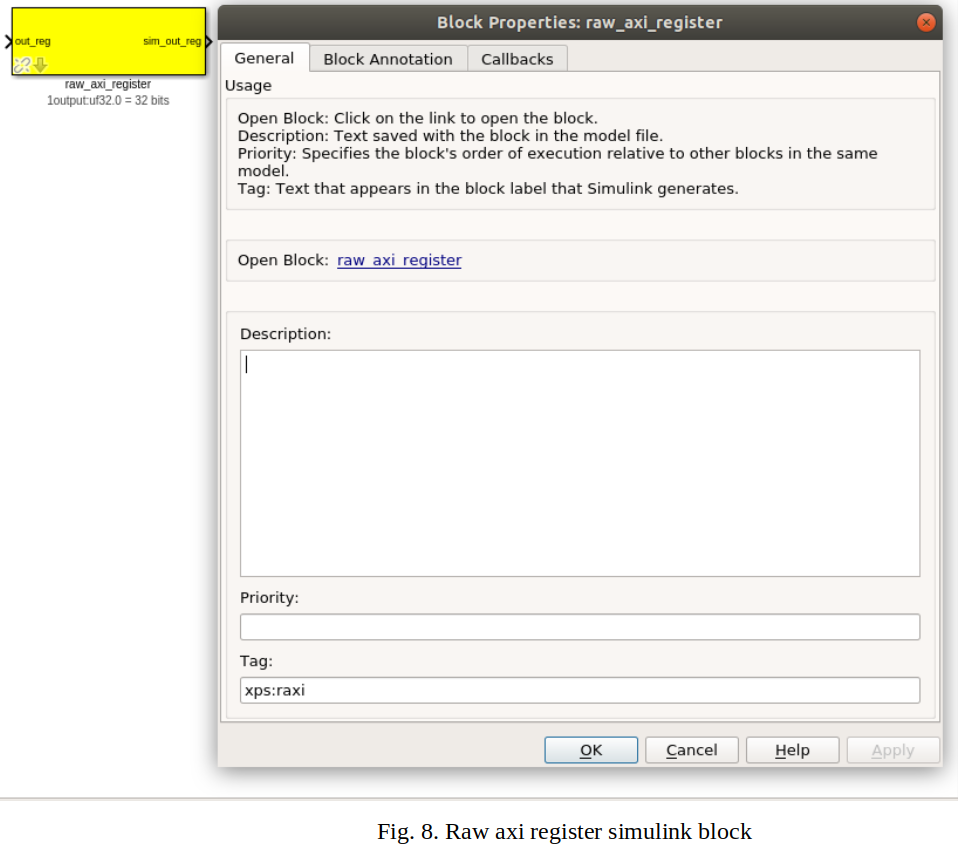

####   ii Yellow Block Python Script (raw_axi.py)
It is important to name the yellow block python script and yellow_block class as the simulink block tag. The yellow block script code is similar to that of the software register except that the code under the 'From Processor' is replaced by the code block below. Note that the code has only been tested for the 'From Processor' configured software register, that has 'rw' permissions.

            if self.platform.mmbus_architecture == 'AXI4-Lite':
                module = 'raw_axi4lite_slave'
                **top.add_axi4lite_interface(regname=self.unique_name, mode='rw', nbytes=4, default_val=self.init_val, typecode=self.typecode, axi4lite_mode='raw')**
                inst = top.get_instance(entity=module, name=self.fullname)
                **inst.add_axi_interface(regname=self.unique_name, mode='rw', nbytes=4, default_val=self.init_val, typecode=self.typecode, axi4lite_mode='raw')**
                # axi4lite clock and reset signals
                inst.add_port('axi4lite_aclk',    'axil_clk')
                inst.add_port('axi4lite_aresetn', 'axil_rst_n')
                inst.add_port('user_data_out', '%s_user_data_out' %self.fullname, width=32)

The function add_axi4lite_interface() creates the axi4lite interface at top level as discussed while function add_axi_interface() in /mlib_devel_axi/jasper_library/verilog.py adds all the axi4lite ports.                

####   iii Creating hdl Source Code
The hdl source code for the raw AXI device will obviously contain a declaration of the axi4lite ports. If the connecting blocks have record type signals then these port signals need to be assigned to the corresponding split record type signals.
The achitecture body of the raw_axi4lite_device may contain the entire hdl slave logic or may be connected up to the xml2vhdl generated code for that device using 'port map'.

## 6. XML File Generation
Each axi4lite interface is represented by an xml memory map file generated by the toolflow; /mlib_devel/jasper_library/toolflow.py > Toolflow.generate_xml_memory_map() and Toolflow.generate_xml_ic() based on the python xml libraries. The generate_xml_memory_map() function generates the xml memory map files that represent each AXI4-Lite interface. The generate_xml_ic() generates the xml interconnect file that represent top-level AXI4-Lite interconnect by linking to the individual memory map interfaces. 
The generated xml file for the sys_block is shown below. It can be seen that the root Element has an id="sys_block". The respective child Elements have attributes (address, axi4lite_mode, description, hw_rst, id, mask, permission) that are assigned values for the different sys_block registers. Note that the registers' child Elements have varying attributes depending on whether the register mode is 'r' or 'rw' and the register is a ram or not.

        <?xml version="1.0" ?>
    <node id="sys_block">
	    <node address="0x0" axi4lite_mode="" description="sys_block_sys_board_id" hw_rst="4" id="sys_board_id" mask="0xffffffff" permission="r"/>
	    <node address="0x4" axi4lite_mode="" description="sys_block_sys_rev" hw_rst="65536" id="sys_rev" mask="0xffffffff" permission="r"/>
	    <node address="0xc" axi4lite_mode="" description="sys_block_sys_rev_rcs" hw_rst="1" id="sys_rev_rcs" mask="0xffffffff" permission="r"/>
	    <node address="0x10" axi4lite_mode="" description="sys_block_sys_scratchpad" hw_rst="0" id="sys_scratchpad" mask="0xffffffff" permission="rw"/>
	    <node address="0x14" axi4lite_mode="" description="sys_block_sys_clkcounter" hw_permission="w" id="sys_clkcounter" mask="0xffffffff" permission="r"/>
    </node>

The generated xml files are located at .../design_directory/xml2vhdl_source. In this directory, you will find the following files: axi4lite_top_ic_memory_map.xml, sys_block_memory_map.xml, sw_reg_memory_map.xml, shared_bram_memory_map.xml and any raw axi memory map file(s). 

The corresponding hdl code is generated by the xml2vhdl python code developed by the University of Oxford based on these xml files by calling the Xml2VhdlGenerate(args) function from xml2vhdl() in toolflow.py. The generated hdl files are located at .../design_directory/xml2vhdl_hdl_output. In this directory, you will find package and source files for the different interfaces.
The documentation of the xml2vhdl is planned.

References

   [1]  RealDigital, Electrical & Computer Engineering Education, "Digital Systems/Axi4-Lite interface," https://www.realdigital.org/doc/a9fee931f7a172423e1ba73f66ca4081#introduction-to-axi4-lite-advanced-extensible-interface

   [2] Cristian Sisterna, Joint ICTP-IAEA School on Zynq-7000 SoC and its Applications for Nuclear and Related Instrumentation, "Introduction to AXI-Custom IP," http://indico.ictp.it/event/7987/session/38/contribution/141/material/slides/0.pdf

   [3] R. Griffin, Silica EMEA, "Designing a Custom AXI-lite Slave Peripheral," version 1.0, July 2014, file:///tmp/mozilla_mathews0/designing_a_custom_axi_slave_rev1-1.pdf

   [4] CASPER toolflow; https://github.com/casper-astro/mlib_devel

