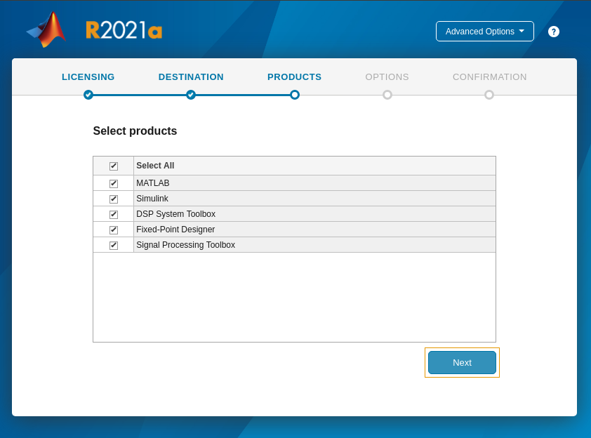

# How to install MATLAB 

This section explains how to install MATLAB.

## [Current Vivado flow] How To install R2021a

1. Required OS: Ubuntu 20.04 LTS.
2. Download the MATLAB installer [here](https://www.mathworks.com/downloads/). Select the `2021a` install, and the `Download for Linux` option.
3. Run the following in the terminal:
    ```bash
    cd /path/to/matlab/download/matlab_R2021a_glnxa64.zip
    mkdir matlab_R2021a
    unzip matlab_R2021a_glnxa64.zip -d matlab_R2021a
    cd matlab_R2021a
    sudo ./install
    ```
4. The above will launch the MathWorks product installer and you will be prompted to sign into your MathWorks account. Sign in, accept the licensing agreement, link your MATLAB license and select your installation path in the prompts that follow.
5. Select the following toolboxes for installation:

    

    *[Note: issues have been encountered where the Xilinx System Generator MATLAB tool may sit indefinitely while generating sysgen IP. This has tentatively been narrowed down to issues in some MATLAB toolboxes, so if your work requires any toolboxes other than the above, please check against the list further down in [this](https://support.xilinx.com/s/question/0D52E00006vF6FOSA0/model-composer-v20212-matlab-r2021a-gets-stuck-at-initialization-stage-on-ubuntu-20041?language=en_US) for any potential conflicts.]* 

6. Click through the rest of the installation, confirm your selections and begin the install.
7. In order to run the Vivado flow of the CASPER tools, please see [here](https://casper-toolflow.readthedocs.io/en/latest/src/Configuring-the-Toolflow.html).

## [ISE legacy flow, ROACH2] How to install R2013b

1. Required OS: Ubuntu 14.04 LTS
2. Ubuntu 14.04. Using Nautilius, click on R2013b_UNIX.iso and extract to “Installs/MATLAB2013b”.
3. Ubuntu 14.04. Open a terminal < ctrl + alt + T>. You will need to install the JRE (Java Runtime Environment) if you don’t have it. Type `​sudo apt-get install openjdk-7-jre` at the prompt and press enter.
4. Terminal: You will now need to backup file “libstdc++.so.6” and link to file “libstdc++.so.6.0.13”. Type in `​cd ~/Installs/MATLAB2013b/bin/glnxa64` and press enter.
5. Terminal: Type `sudo mv libstdc++.so.6 libstdc++.so.6_bu` and enter. The file should now be backed up.
6. Terminal: Type `sudo ln -s libstdc++.so.6.0.13 libstdc++.so.6` and press enter. The file should now be linked.
7. Terminal: set the matlab environment variable to call java 7. Type `​export MATLAB_JAVA=”/usr/lib/jvm/java-7-openjdk-amd64/jre` and press enter. Type `​echo $MATLAB_JAVA` to make sure the new path is set.
8. Terminal: Make sure the java is executable. Type `​cd ~/Installs/MATLAB2013b` and press enter. Type `​chmod +x sys/java/jre/glnxa64/jre/bin/java` and press enter.
9. Terminal: You will now need to invoke the installer. Type `​sudo ./install -javadir /usr/lib/jvm/java-7-openjdk-amd64/jre` at the prompt and press enter.
10. The MathWorks Installer GUI should pop up. Select “Install without using the Internet” and select “Next”.
11. You will be requested to sign the “License Agreement” page. Click “Yes” and then click “Next”.
12. You will be requested to fill in the file installation key for your license. The MATLAB Administrator should of provided a license and file installation key. If not, make sure you get one from him/her. Type in the file installation key and press “Next”. I choose to install my license file under “~/MATLAB”.
13. You will then be requested for the “Installation Type”. Click on the “Typical” radio button and press “Next”.
14. You will then need to specify the installation folder. I choose “/opt/MATLAB/R2013b”. Press “Next”. If the folder does not exist then click “Yes” to create it.
15. You will then be required to confirm your installation settings. If happy then press “Install” else press “Back” and then return to this step when happy.
16. You will be informed that your installation may require additional configuration skips. This can be ignored. Click “Next”.
17. You will be informed that the installation is complete. Make sure Activate MATLAB is ticked and click “Next”.
18. It is now time to Activate MathWorks Software. A “MathWorks Software Activation” window will pop up. Click on the “Activate manually without the internet” and press “Next”.
19. Click on the “Enter the full path to your license file, including the file name:” and browse to the license file (*.lic) and click “Select”. Then press “Next”. If all goes well then you will receive a message that says “Activation is complete.”. Click “Finish”.
20. Open another terminal and navigate to the “opt” folder and remember to change user and group to your username with the following command: `sudo chown <username>:<username> MATLAB -R`
21. Terminal: Navigate to the “home” folder and remember to change user and group to your username with the following command: `sudo chown <username>:<username> .matlab -R`
22. It will be a good idea to create an MATLAB R2013b startup script file on your Desktop with the following lines:
    ```bash
    #!/bin/bash
    cd /opt/MATLAB/R2013b/bin/
    ./matlab
    ```
    NB: Make sure the file is executable and that the nautilius documentation navigator is set to run the script.

23. Run the script and the MATLAB IDE will launch. You can now select the required MATLAB m files (*.m) and continue.
24. In order to run the ISE-flow of the CASPER tools, please see [here](https://casper.berkeley.edu/wiki/MSSGE_Setup_with_Xilinx_14.x_and_MATLAB_2012b)
