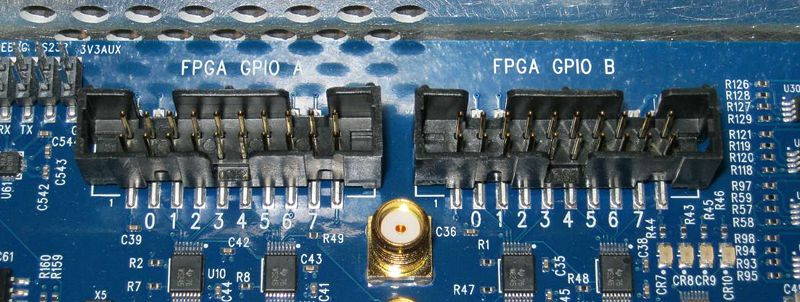

GPIO
======
| **Block:** GPIO (``gpio``)
| **Block Author**: Pierre-Yves Droz
| **Document Author**: Billy Mallard

+--------------------------------------------------------------------------+
| .. raw:: html                                                            |
|                                                                          |
|    
                                                   |
|                                                                          |
| .. rubric:: Contents                                                     |
|    :name: contents                                                       |
|                                                                          |
| .. raw:: html                                                            |
|                                                                          |
|    
                                                                |
|                                                                          |
| -  `Summary <#summary>`__                                                |
| -  `Mask Parameters <#mask-parameters>`__                                |
| -  `Ports <#ports>`__                                                    |
| -  `Description <#description>`__                                        |
|                                                                          |
|    -  `ROACH Specific Information <#roach-specific-information>`__       |
|                                                                          |
| -  `Notes <#notes>`__                                                    |
+--------------------------------------------------------------------------+

Summary 
--------
The gpio block provides access to GPIO pins on any board that has GPIO
headers.

Mask Parameters 
----------------

+----------------------------+-------------------+------------------------------------------------------------------------+
| Parameter                  | Variable          | Description                                                            |
+============================+===================+========================================================================+
| I/O group                  | io\_group         | Selects the board architecture and the GPIO header on that board.      |
+----------------------------+-------------------+------------------------------------------------------------------------+
| I/O direction              | io\_dir           | Chooses whether the pin sends data ``out`` of or ``in`` to the FPGA.   |
+----------------------------+-------------------+------------------------------------------------------------------------+
| Data Type                  | arith\_type       | Specifies data type of register.                                       |
+----------------------------+-------------------+------------------------------------------------------------------------+
| Data bitwidth              | bitwidth          | Specifies data bitwidth.                                               |
+----------------------------+-------------------+------------------------------------------------------------------------+
| Data binary point          | bin\_pt           | Specifies the binary point position of data.                           |
+----------------------------+-------------------+------------------------------------------------------------------------+
| GPIO bit index             | bit\_index        | Specifies the pin on the selected GPIO header.                         |
+----------------------------+-------------------+------------------------------------------------------------------------+
| Sample period              | sample\_period    | Specifies sample period of interface.                                  |
+----------------------------+-------------------+------------------------------------------------------------------------+
| Use DDR                    | use\_ddr          |  ???                                                                   |
+----------------------------+-------------------+------------------------------------------------------------------------+
| Pack register in the pad   | reg\_iob          |  ???                                                                   |
+----------------------------+-------------------+------------------------------------------------------------------------+
| Register clock phase       | reg\_clk\_phase   | ``0``, ``90``, ``180``, ``270``.                                       |
+----------------------------+-------------------+------------------------------------------------------------------------+
| Termination method         | termination       | ``None``, ``Pullup``, ``Pulldown``.                                    |
+----------------------------+-------------------+------------------------------------------------------------------------+

Ports 
------

+------------+-------+-------------+------------------------------------------------------------+
| Port       | Dir   | Data Type   | Description                                                |
+============+=======+=============+============================================================+
| reg\_out   | in    | inherited   | Output from design to GPIO pin. Only in I/O ``in`` mode.   |
+------------+-------+-------------+------------------------------------------------------------+
| sim\_out   | out   | double      | Simulation output of pin value. Only in I/O ``in`` mode.   |
+------------+-------+-------------+------------------------------------------------------------+
| sim\_in    | in    | double      | Simulation input of pin value. Only in I/O ``out`` mode.   |
+------------+-------+-------------+------------------------------------------------------------+
| reg\_in    | out   | inherited   | Input from GPIO pin to design. Only in I/O ``out`` mode.   |
+------------+-------+-------------+------------------------------------------------------------+

Description 
------------
ROACH Specific Information 
^^^^^^^^^^^^^^^^^^^^^^^^^^^^
*Main article:* `ROACH FPGA Interfaces <https://casper.berkeley.edu/wiki/ROACH_FPGA_Interfaces>`__

Each GPIO header has one direction selector that controls the direction
of all 8 of its pins. You must set a direction. So, in addition to your
normal ``gpio`` block (configured for I/O group ``ROACH:gpio[ab]``), add
another ``gpio`` block, and set the following parameters:

-  I/O group = ``ROACH:gpio[ab]_oe_n``
-  I/O direction = ``out``
-  bitwidth = ``1``
-  bit\_index = ``0``

The direction selector takes a boolean value as its input, so wire it to
a Xilinx constant block:

-  ``0`` - output from ROACH
-  ``1`` - input to ROACH

The two SMA connectors on the back of the board are wired directly to
GPIO pins. Specifically, J11 and J10 are wired to pins 6 and 7 on GPIO
A.

Notes 
------
The order of the FPGA GPIOs have been changed from "3 2 1 0 7 6 5 4" to
now match the order printed on the PCB "0 1 2 3 4 5 6 7".

|image|

Old mapping: 3 2 1 0 7 6 5 4

New mapping: 0 1 2 3 4 5 6 7

