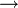

Partial Delay
==============
| **Block:** Partial Delay Block (``partial_delay``)
| **Block Author**: Aaron Parsons
| **Document Author**: Aaron Parsons

+--------------------------------------------------------------------------+
| .. raw:: html                                                            |
|                                                                          |
|    
                                                   |
|                                                                          |
| .. rubric:: Contents                                                     |
|    :name: contents                                                       |
|                                                                          |
| .. raw:: html                                                            |
|                                                                          |
|    
                                                                |
|                                                                          |
| -  `Summary <#summary>`__                                                |
| -  `Mask Parameters <#mask-parameters>`__                                |
| -  `Ports <#ports>`__                                                    |
| -  `Description <#description>`__                                        |
+--------------------------------------------------------------------------+

Summary 
--------
For a set of parallel inputs which represent consecutive time samples of
the same input signal, this block delays the stream by a dynamically
selectable number of samples between 0 and (n\_inputs-1).

Mask Parameters 
----------------

+------------------+-------------+----------------------------------+
| Parameter        | Variable    | Description                      |
+==================+=============+==================================+
| No. of inputs.   | n\_inputs   | The number of parallel inputs.   |
+------------------+-------------+----------------------------------+
| Mux Latency      | latency     | The latency of each mux block.   |
+------------------+-------------+----------------------------------+

Ports 
------

+--------+--------+-------------+--------------------------------------------------------+
| Port   | Dir    | Data Type   | Description                                            |
+========+========+=============+========================================================+
| sync   |  ???   |  ???        | Indicates the next clock cycle containing valid data   |
+--------+--------+-------------+--------------------------------------------------------+
| din    | in     |  ???        | A number to be summed.                                 |
+--------+--------+-------------+--------------------------------------------------------+

Description 
------------
Ex.: Mapping of 4 parallel input samples to output for delay = 2.

+-----+---+---+-----+--------------+-----+---+-----+-----+
| ... | 4 | 0 | ... | |rightarrow| | 6   | 2 | ... | ... |
+-----+---+---+-----+--------------+-----+---+-----+-----+
| ... | 5 | 1 | ... | |rightarrow| | 7   | 3 | ... | ... |
+-----+---+---+-----+--------------+-----+---+-----+-----+
| ... | 6 | 2 | ... | |rightarrow| | ... | 4 | 0   | ... |
+-----+---+---+-----+--------------+-----+---+-----+-----+
| ... | 7 | 3 | ... | |rightarrow| | ... | 5 | 1   | ... |
+-----+---+---+-----+--------------+-----+---+-----+-----+

