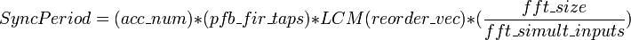

Sync Pulse Generator
=====================
| **Block:** Sync Pulse Generator (``sync_gen``)
| **Block Author**: Mark Wagner, Suraj Gowda
| **Document Author**: Suraj Gowda, Billy Mallard

+--------------------------------------------------------------------------+
| .. raw:: html                                                            |
|                                                                          |
|    
                                                   |
|                                                                          |
| .. rubric:: Contents                                                     |
|    :name: contents                                                       |
|                                                                          |
| .. raw:: html                                                            |
|                                                                          |
|    
                                                                |
|                                                                          |
| -  `Summary <#summary>`__                                                |
| -  `Mask Parameters <#mask-parameters>`__                                |
| -  `Ports <#ports>`__                                                    |
| -  `Description <#description>`__                                        |
+--------------------------------------------------------------------------+

Summary 
--------
Generates a sync pulse of an appropriate period for a design.

Mask Parameters 
----------------

+----------------------------------+-----------------------+-----------------------------------------------------------------------------------------------------------------------------------------------------------------------------------------------------+
| Parameter                        | Variable              | Description                                                                                                                                                                                         |
+==================================+=======================+=====================================================================================================================================================================================================+
| Simulation Accumulation Length   | gen\_acc\_len         | The accumulation length that will be used for generation.                                                                                                                                           |
+----------------------------------+-----------------------+-----------------------------------------------------------------------------------------------------------------------------------------------------------------------------------------------------+
| FFT Size                         | fft\_size             | The size of the FFT.                                                                                                                                                                                |
+----------------------------------+-----------------------+-----------------------------------------------------------------------------------------------------------------------------------------------------------------------------------------------------+
| Simultaneous Inputs (FFT)        | fft\_simult\_inputs   | The number of data inputs into the FFT.                                                                                                                                                             |
+----------------------------------+-----------------------+-----------------------------------------------------------------------------------------------------------------------------------------------------------------------------------------------------+
| Taps in pfb\_fir                 | pfb\_fir\_taps        | The number of PFB filter taps. If your design does not use a pfb\_fir, set this to 1.                                                                                                               |
+----------------------------------+-----------------------+-----------------------------------------------------------------------------------------------------------------------------------------------------------------------------------------------------+
| Reorder Orders                   | reorder\_vec          | A vector of the orders of the reorder blocks inside the FFT. In your model, the reorder blocks are in fft/fft\_biplex/biplex\_cplx\_unscrambler. The orders should be displayed under the blocks.   |
+----------------------------------+-----------------------+-----------------------------------------------------------------------------------------------------------------------------------------------------------------------------------------------------+
| Scale                            | scale                 | The amount to scale the sync period by.                                                                                                                                                             |
+----------------------------------+-----------------------+-----------------------------------------------------------------------------------------------------------------------------------------------------------------------------------------------------+

Ports 
------

+-------------+-------+-------------+-----------------------------+
| Port        | Dir   | Data Type   | Description                 |
+=============+=======+=============+=============================+
| sync\_out   | out   | Boolean     | The generated sync pulse.   |
+-------------+-------+-------------+-----------------------------+

Description 
------------
The ``sync_gen`` block computes the sync pulse period as:

|SyncPeriod|

This formula is derived in `Memo
#25 <https://github.com/casper-astro/publications/blob/master/Memos/files/sync_memo_v1.pdf>`__.

