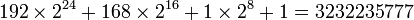

10 GbE Transceiver
===================
| **Block:** 10GbE Transceiver (``ten_gbe``)
| **Block Author**: David George
| **Document Author**: David George

+--------------------------------------------------------------------------+
| .. raw:: html                                                            |
|                                                                          |
|    
                                                   |
|                                                                          |
| .. rubric:: Contents                                                     |
|    :name: contents                                                       |
|                                                                          |
| .. raw:: html                                                            |
|                                                                          |
|    
                                                                |
|                                                                          |
| -  `Summary <#summary>`__                                                |
| -  `Mask Parameters <#mask-parameters>`__                                |
| -  `Ports <#ports>`__                                                    |
| -  `Description <#description>`__                                        |
|                                                                          |
|    -  `Configuration <#configuration>`__                                 |
|    -  `Transmitting <#transmitting>`__                                   |
|    -  `Receiving <#receiving>`__                                         |
|    -  `Addressing <#addressing>`__                                       |
|    -  `LED Outputs <#led-outputs>`__                                     |
|    -  `Operation <#operation>`__                                         |
+--------------------------------------------------------------------------+

Summary 
--------
This block sends and receives UDP frames (packets). It accepts a 64 bit
wide data stream with user-determined frame breaks. The data stream is
wrapped in a UDP frame for transmission. Incoming UDP packets are
unwrapped and the data presented as a 64 bit wide stream.

Mask Parameters 
----------------

+----------------------------+-----------------+---------------------------------------------------------------------------------------------------------------------------------------------------------------------------------------------------------------------------------------+
| Parameter                  | Variable        | Description                                                                                                                                                                                                                           |
+============================+=================+=======================================================================================================================================================================================================================================+
| Port                       | port            | Selects the physical CX4 port.                                                                                                                                                                                                        |
+----------------------------+-----------------+---------------------------------------------------------------------------------------------------------------------------------------------------------------------------------------------------------------------------------------+
| Shallow RX Fifo            | rx\_dist\_ram   | Selects shallow distributed RAM rather than BRAM for the RX FIFO. This option should only be used if the application clock is faster than 156.25 MHz. Constant overruns will most likely occur for clock frequency lower than this.   |
+----------------------------+-----------------+---------------------------------------------------------------------------------------------------------------------------------------------------------------------------------------------------------------------------------------+
| Pre-emphasis               | pre\_emph       | Selects the default pre-emaphasis to use over the physical link. Currently unused.                                                                                                                                                    |
+----------------------------+-----------------+---------------------------------------------------------------------------------------------------------------------------------------------------------------------------------------------------------------------------------------+
| Differential Swing         | swing           | Selects the size of the differential swing to use in mV. Currently unused.                                                                                                                                                            |
+----------------------------+-----------------+---------------------------------------------------------------------------------------------------------------------------------------------------------------------------------------------------------------------------------------+
| Enable Fabric on Startup   | fab\_en         | This will enable the 10Ge interface on start-up, negating the requirement of software intervention.                                                                                                                                   |
+----------------------------+-----------------+---------------------------------------------------------------------------------------------------------------------------------------------------------------------------------------------------------------------------------------+
| Fabric MAC Addresss        | fab\_mac        | Sets the default MAC, usually configured by software.                                                                                                                                                                                 |
+----------------------------+-----------------+---------------------------------------------------------------------------------------------------------------------------------------------------------------------------------------------------------------------------------------+
| Fabric IP Addresss         | fab\_ip         | Sets the default IP, usually configured by software.                                                                                                                                                                                  |
+----------------------------+-----------------+---------------------------------------------------------------------------------------------------------------------------------------------------------------------------------------------------------------------------------------+
| Fabric UDP Port            | fab\_port       | Sets the default UDP Port, usually configured by software.                                                                                                                                                                            |
+----------------------------+-----------------+---------------------------------------------------------------------------------------------------------------------------------------------------------------------------------------------------------------------------------------+
| Fabric Gateway             | fab\_gate       | Sets the default gateway address, usually configured by software.                                                                                                                                                                     |
+----------------------------+-----------------+---------------------------------------------------------------------------------------------------------------------------------------------------------------------------------------------------------------------------------------+
| Enable CPU RX              | cpu\_rx\_en     | Optionally disable the CPU receive interface to save 2 BRAMS, if that interface is not required.                                                                                                                                      |
+----------------------------+-----------------+---------------------------------------------------------------------------------------------------------------------------------------------------------------------------------------------------------------------------------------+
| Enable CPU TX              | cpu\_tx\_en     | Optionally disable the CPU trasmit interface to save 2 BRAMS, if that interface is not required.                                                                                                                                      |
+----------------------------+-----------------+---------------------------------------------------------------------------------------------------------------------------------------------------------------------------------------------------------------------------------------+

Ports 
------

+----------------------+-------+---------------+-------------------------------------------------------------------------------------------------------------------------------------------------------------------------------------+
| Port                 | Dir   | Data Type     | Description                                                                                                                                                                         |
+======================+=======+===============+=====================================================================================================================================================================================+
| rst                  | in    | boolean       | Resets the transmit and receive memories when asserted                                                                                                                              |
+----------------------+-------+---------------+-------------------------------------------------------------------------------------------------------------------------------------------------------------------------------------+
| tx\_data             | in    | UFix\_64\_0   | The data stream to be transmitted                                                                                                                                                   |
+----------------------+-------+---------------+-------------------------------------------------------------------------------------------------------------------------------------------------------------------------------------+
| tx\_valid            | in    | boolean       | The core accepts the data on ``tx_data`` into the buffer while this line is high                                                                                                    |
+----------------------+-------+---------------+-------------------------------------------------------------------------------------------------------------------------------------------------------------------------------------+
| tx\_dest\_ip         | in    | UFix\_32\_0   | Selects the IP address of the receiving device                                                                                                                                      |
+----------------------+-------+---------------+-------------------------------------------------------------------------------------------------------------------------------------------------------------------------------------+
| tx\_dest\_port       | in    | UFix\_16\_0   | Selects the listening port of the receiving device (UDP port)                                                                                                                       |
+----------------------+-------+---------------+-------------------------------------------------------------------------------------------------------------------------------------------------------------------------------------+
| tx\_end\_of\_frame   | in    | boolean       | Signals the transceiver to begin transmitting the buffered frame (ie signals end of the frame). This signal must pulse high on the same clock cycle as the final tx\_valid signal   |
+----------------------+-------+---------------+-------------------------------------------------------------------------------------------------------------------------------------------------------------------------------------+
| rx\_ack              | in    | boolean       | Used to acknowledge reception of the data currently on rx\_data and signals the transceiver to produce the next 64 bits from the receiver FIFO.                                     |
+----------------------+-------+---------------+-------------------------------------------------------------------------------------------------------------------------------------------------------------------------------------+
| rx\_overrun\_ack     | in    | boolean       | Used to reset the RX state machine when a RX overrun occurs.                                                                                                                        |
+----------------------+-------+---------------+-------------------------------------------------------------------------------------------------------------------------------------------------------------------------------------+
| led\_up              | out   | boolean       | Indicates a link on the port                                                                                                                                                        |
+----------------------+-------+---------------+-------------------------------------------------------------------------------------------------------------------------------------------------------------------------------------+
| led\_rx              | out   | boolean       | Represents received traffic on the port                                                                                                                                             |
+----------------------+-------+---------------+-------------------------------------------------------------------------------------------------------------------------------------------------------------------------------------+
| led\_tx              | out   | boolean       | Represents transmitted traffic on the port                                                                                                                                          |
+----------------------+-------+---------------+-------------------------------------------------------------------------------------------------------------------------------------------------------------------------------------+
| tx\_afull            | out   | boolean       | Indicates that the TX FIFO is almost full                                                                                                                                           |
+----------------------+-------+---------------+-------------------------------------------------------------------------------------------------------------------------------------------------------------------------------------+
| tx\_overflow         | out   | boolean       | Indicates that the TX FIFO has overflowed                                                                                                                                           |
+----------------------+-------+---------------+-------------------------------------------------------------------------------------------------------------------------------------------------------------------------------------+
| rx\_data             | out   | UFix\_64\_0   | The received data stream.                                                                                                                                                           |
+----------------------+-------+---------------+-------------------------------------------------------------------------------------------------------------------------------------------------------------------------------------+
| rx\_valid            | out   | boolean       | Indicates that the data on rx\_data is valid (indicates a packet, or partial packet is in the RX buffer).                                                                           |
+----------------------+-------+---------------+-------------------------------------------------------------------------------------------------------------------------------------------------------------------------------------+
| rx\_source\_ip       | out   | UFix\_32\_0   | Represents the IP address of the sender of the current packet.                                                                                                                      |
+----------------------+-------+---------------+-------------------------------------------------------------------------------------------------------------------------------------------------------------------------------------+
| rx\_source\_port     | out   | UFix\_16\_0   | Represents the sender's UDP port of the current packet.                                                                                                                             |
+----------------------+-------+---------------+-------------------------------------------------------------------------------------------------------------------------------------------------------------------------------------+
| rx\_end\_of\_frame   | out   | boolean       | Goes high to indicate the end of the received frame.                                                                                                                                |
+----------------------+-------+---------------+-------------------------------------------------------------------------------------------------------------------------------------------------------------------------------------+
| rx\_bad\_frame       | out   | UFix\_16\_0   | Indicates a CRC error on the frame immediately received when asserted simultaneously with ``rx_end_of_frame``.                                                                      |
+----------------------+-------+---------------+-------------------------------------------------------------------------------------------------------------------------------------------------------------------------------------+
| rx\_overrun          | out   | UFix\_16\_0   | Indicates that an RX buffer overrun when asserted simultaneously with ``rx_end_of_frame``.                                                                                          |
+----------------------+-------+---------------+-------------------------------------------------------------------------------------------------------------------------------------------------------------------------------------+

Description 
-------------
This document is a draft and requires verification.

Configuration 
^^^^^^^^^^^^^^
This core will typically be configured by software by setting the
following OPB registers: MAC, IP, UDP port, ARP table, gateway and
fabric enable. However, there are currently parameters to set these
values (except for the ARP table) at build time.

Transmitting 
^^^^^^^^^^^^^^
To transmit, data is clocked into the TX buffer through ``tx_data`` in
64 bit wide words using ``tx_valid``. When sending the final word of
data in the packet, simultaneously pulse the ``tx_end_of_frame`` line;
the transceiver will add a UDP wrapper addressed to
``tx_dest_ip:tx_dest_port`` and begin transmission immediately. Note
that tx\_dest\_ip and tx\_dest\_port are only looked at when
tx\_end\_of\_frame is pulsed high, thus the value must be valid for that
clock period but is irrelevant otherwise.

The transmit FIFO can only handle frame sizes of up to 8704 bytes, or
1088 64 bit words. As the TX FIFO approaches full, the ``tx_afull``
signal will be asserted. This is an indication that the application
should stop entering data into the core. If the application overflows
the TX buffer, the ``tx_overflow`` signal will be asserted. When the
overflow is asserted the TX interface will block, requiring a reset
(using ``rst``) to return to full functionality.

Receiving 
^^^^^^^^^^
Upon receipt of a packet, ``rx_valid`` will go high, with the received
data presented on ``rx_data`` in 64 bit wide words. You acknowledge
receipt of this data using ``rx_ack``, at which point the next data word
will be presented. When the end of the packet is reached,
``rx_end_of_frame`` will go high. If the a CRC error occurred when
receiving the packet, the ``rx_bad_frame`` signal will be asserted.

If the RX data overran the RX FIFO, the ``rx_overrun`` signal will be
asserted along with ``rx_end_of_frame``. When this occurs the RX state
machine will block until the ``rx_overrun_ack`` is asserted. It is
recommended that the ``rx_overrun`` be directly connected to the
``rx_overrun_ack`` signal.

There is no hard maximum frame size for RX. However, care must be taken
not to overrun the rx buffer.

Addressing 
^^^^^^^^^^^
To transmit, the IPv4 address is represented as a 32 bit binary number
(whereas it's usually represented as four 8 bit decimal numbers). For
example, if you wanted to send all packets to ``192.168.1.1``, you would
enter

|address|

as the IP address. The port is represented by a 16 bit number, allowing
full addressing of the UDP port range. Ports below 1024 are generally
reserved for Linux kernel and Internet functions. Ports 1024 - 49151 are
registered for specific applications and may not be used without IANA
registration. To ensure inter-operability and compatibility, we
recommend using dynamic (private) ports 49152 through 65535.

LED Outputs 
^^^^^^^^^^^^
The LED lines indicate port activity and can be connected to external
GPIO LED interfaces. Bear in mind that even if no packets are being
transmitted or received through the Simulink interface block,
miscellaneous configuration packets are still sent and may be received
by the microprocessor core. This activity will also be reflected on the
activity LEDs.

Operation 
^^^^^^^^^^
Apart from configuring the block, the processor is also used to map the
routing tables. ARP requests and responses are handled by the CPU.

