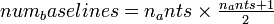
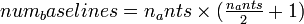
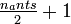

Windowed X-Engine
==================
| **Block:** Windowed X-Engine (``win_x_engine``)
| **Block Author**: Jason Manley, Aaron Parsons, Terry Filiba
| **Document Author**: Jason Manley

+--------------------------------------------------------------------------+
| .. raw:: html                                                            |
|                                                                          |
|    
                                                   |
|                                                                          |
| .. rubric:: Contents                                                     |
|    :name: contents                                                       |
|                                                                          |
| .. raw:: html                                                            |
|                                                                          |
|    
                                                                |
|                                                                          |
| -  `Summary <#summary>`__                                                |
| -  `Mask Parameters <#mask-parameters>`__                                |
| -  `Ports <#ports>`__                                                    |
| -  `Description <#description>`__                                        |
|                                                                          |
|    -  `Introduction <#introduction>`__                                   |
|    -  `Input format <#input-format>`__                                   |
|    -  `Output Format <#output-format>`__                                 |
+--------------------------------------------------------------------------+

Summary 
--------
CASPER X engine with added internal valid data masking functionality.
Based on Aaron Parsons' design.

Mask Parameters 
----------------

+-----------------------------------+--------------------+----------------------------------------------------------------------------------------------------------------------------------+
| Parameter                         | Variable           | Description                                                                                                                      |
+===================================+====================+==================================================================================================================================+
| Number of antennas                | n\_ants            | Number of antennas to process.                                                                                                   |
+-----------------------------------+--------------------+----------------------------------------------------------------------------------------------------------------------------------+
| Bit width of samples in           | n\_bits            | Bit width of each input sample number. Usually set to 4, resulting in 16 bit input numbers (2 polarizations, complex numbers).   |
+-----------------------------------+--------------------+----------------------------------------------------------------------------------------------------------------------------------+
| Accumulation length               | acc\_len           | Specified per antenna.                                                                                                           |
+-----------------------------------+--------------------+----------------------------------------------------------------------------------------------------------------------------------+
| Adder latency                     | add\_latency       | Used to set the latency of internal adders.                                                                                      |
+-----------------------------------+--------------------+----------------------------------------------------------------------------------------------------------------------------------+
| Multiplier latency                | mult\_latency      | Used to set the latency of internal multipliers.                                                                                 |
+-----------------------------------+--------------------+----------------------------------------------------------------------------------------------------------------------------------+
| BRAM latency                      | bram\_latency      | Used to set the latency of internal BRAMs.                                                                                       |
+-----------------------------------+--------------------+----------------------------------------------------------------------------------------------------------------------------------+
| Implementation: Multiplier type   | use\_ded\_mult     | Select the type of multipliers to use. Can be a single number or array - see below.                                              |
+-----------------------------------+--------------------+----------------------------------------------------------------------------------------------------------------------------------+
| Implementation: Delay type        | use\_bram\_delay   | Selects the type of delays to implement. Single number configures all internal taps.                                             |
+-----------------------------------+--------------------+----------------------------------------------------------------------------------------------------------------------------------+

Ports 
------

+-----------------+-------+------------------------------+-----------------------------------------------------------------------------------------+
| Port            | Dir   | Data Type                    | Description                                                                             |
+=================+=======+==============================+=========================================================================================+
| ant             | in    | variable width. see below.   | Input port for incoming antenna data.                                                   |
+-----------------+-------+------------------------------+-----------------------------------------------------------------------------------------+
| sync\_in        | in    | boolean                      | Synchronization pulse. New window begins clock cycle after sync received.               |
+-----------------+-------+------------------------------+-----------------------------------------------------------------------------------------+
| window\_valid   | in    | boolean                      | Indicates incoming antenna data is valid. Must remain constant for acc\_len\*n\_ants.   |
+-----------------+-------+------------------------------+-----------------------------------------------------------------------------------------+
| acc             | out   | variable width. see below.   | Output data.                                                                            |
+-----------------+-------+------------------------------+-----------------------------------------------------------------------------------------+
| valid           | out   | boolean                      | Indicates data on acc is valid.                                                         |
+-----------------+-------+------------------------------+-----------------------------------------------------------------------------------------+
| sync\_out       | out   | boolean                      | Passthrough for sync pulses.                                                            |
+-----------------+-------+------------------------------+-----------------------------------------------------------------------------------------+

Description 
------------
Introduction 
^^^^^^^^^^^^^
The CASPER X engine is a streaming architecture block where complex
antenna data is input and accumulated products (for all
cross-multiplications) are output in conjugated form. Because it is
streaming with valid data expected on every clock cycle, data is
logically divided into windows. These windows can either be valid (in
which case the computation yields valid, outputted results) or invalid
(in which case computation still occurs, but the results are ignored and
not presented to the user).

Input format 
^^^^^^^^^^^^^
Data is input serially: ``antenna A, antenna B, antenna C`` etc. Each
antenna's data consists of dual polarization, complex data. The bit
width of each component number can be set as a parameter, ``n_bits``.
The X-engine thus expects these four numbers of ``n_bits`` to be
concatenated into a single, unsigned number. CASPER convention dictates
that complex numbers are represented with higher bits as real and lower
bits as imaginary. The top half of the input number is polarization one
and the lower half polarization two.

The internals of the block are reset with the reception of a sync pulse.
A new window begins on the very next clock cycle. Each window is
``int_len`` * ``n_ants`` clock cycles long. The data for each
antenna is input for ``acc_len`` clock cycles.

For example, for ``n_bits`` of 4 and ``acc_len`` of 2, the input to the
X-engine would be 16 bits every clock cycle mapped as follows:

+-----+---------------------+---------------------+---------------------+---------------------+---------------------+-----------------------------+
| ... | *t*\ :sub:`4`       | *t*\ :sub:`3`       | *t*\ :sub:`2`       | *t*\ :sub:`1`       | *t*\ :sub:`0`       |                |rightarrow| |
+-----+---------------------+---------------------+---------------------+---------------------+---------------------+-----------------------------+
| ... | *C*\ :sub:`1\ real` | *B*\ :sub:`1\ real` | *B*\ :sub:`1\ real` | *A*\ :sub:`1\ real` | *A*\ :sub:`1\ real` |  most\_sig 4b\ |rightarrow| |
+-----+---------------------+---------------------+---------------------+---------------------+---------------------+-----------------------------+
| ... | *C*\ :sub:`1\ imag` | *B*\ :sub:`1\ imag` | *B*\ :sub:`1\ imag` | *A*\ :sub:`1\ imag` | *A*\ :sub:`1\ imag` |            4b\ |rightarrow| |
+-----+---------------------+---------------------+---------------------+---------------------+---------------------+-----------------------------+
| ... | *C*\ :sub:`2\ real` | *B*\ :sub:`2\ real` | *B*\ :sub:`2\ real` | *A*\ :sub:`2\ real` | *A*\ :sub:`2\ real` |            4b\ |rightarrow| |
+-----+---------------------+---------------------+---------------------+---------------------+---------------------+-----------------------------+
| ... | *C*\ :sub:`2\ imag` | *B*\ :sub:`2\ imag` | *B*\ :sub:`2\ imag` | *A*\ :sub:`2\ imag` | *A*\ :sub:`2\ imag` | least\_sig 4b\ |rightarrow| |
+-----+---------------------+---------------------+---------------------+---------------------+---------------------+-----------------------------+

X-engine input with ``acc_len`` of 2.

The ``window_valid`` line is expected to remain constant for the
duration of each window. If it is high, the output is considered valid
and captured into the output FIFO buffer. With the close of that window,
the output will be presented to the user as valid data on every second
clock pulse. If ``window_valid`` was held low, the data is ignored.

With the close of one window, anther begins directly afterwards. Data
can thus be streamed in and out continuously, while a sync pulse will
force the start of a new window.

Output Format 
^^^^^^^^^^^^^^
The windowed X-engine will produce |num_baselines1| valid outputs. 
The unwindowed x engine produces |num_baselines2| results.
The extra valids are a result of the algorithm employed and are masked
out by the internal ``x_engine_mask``.

Generally, the output of the X-engine configured for ``N`` antennas can
be mapped into a table with |tfrac| columns and *N*
rows as follows:

+--------------+-------------+-------------+-----------------+-----------------+-----+--------------+
| 1\ :sup:`st` | 0 |times| 0 | 0 |times| N | 0 |times| (N-1) | 0 |times| (N-2) | ... | |rightarrow| |
+--------------+-------------+-------------+-----------------+-----------------+-----+--------------+
| 2\ :sup:`nd` | 1 |times| 1 | 0 |times| 1 | 1 |times| N     | 1 |times| (N-1) | ... | |rightarrow| |
+--------------+-------------+-------------+-----------------+-----------------+-----+--------------+
| 3\ :sup:`rd` | 2 |times| 2 | 1 |times| 2 | 0 |times| 2     | 2 |times| N     | ... | |rightarrow| |
+--------------+-------------+-------------+-----------------+-----------------+-----+--------------+
| 4\ :sup:`th` | 3 |times| 3 | 2 |times| 3 | 1 |times| 3     | 0 |times| 3     | ... | |rightarrow| |
+--------------+-------------+-------------+-----------------+-----------------+-----+--------------+
| 5\ :sup:`th` | 4 |times| 4 | 3 |times| 4 | 2 |times| 4     | 1 |times| 4     | ... | |rightarrow| |
+--------------+-------------+-------------+-----------------+-----------------+-----+--------------+
| 6\ :sup:`th` | 5 |times| 5 | 4 |times| 5 | 3 |times| 5     | 2 |times| 5     | ... | |rightarrow| |
+--------------+-------------+-------------+-----------------+-----------------+-----+--------------+
| ...          | ...         | ...         | ...             | ...             | ... | |rightarrow| |
+--------------+-------------+-------------+-----------------+-----------------+-----+--------------+

Each table entry represents a valid output. Data is read out right to
left, top to bottom. Bracketed values are from previous window.

As an example, consider the output for a 4 antenna system (with antennas numbered A through D):

+-----+-------------+-------------+-------------+
| 1st | **AA**      | prev win DA | prev win CA |
+-----+-------------+-------------+-------------+
| 2nd | **BB**      | **AB**      | prev win BD |
+-----+-------------+-------------+-------------+
| 3rd | **CC**      | **BC**      | **AC**      | 
+-----+-------------+-------------+-------------+
| 4th | next win AA | **CD**      | **BD**      |
+-----+-------------+-------------+-------------+
| 5th | next win BB | next win AB | **DB**      |
+-----+-------------+-------------+-------------+

Boldfaced type represents current valid window of data. Data is read out
right to left, top to bottom. Non-boldfaced data is masked.

Thanks to the inclusion of the ``x_engine_mask`` block, X-engine output
duplicates (observed in rows 5 and 6 above) are automatically removed.
The output of a 4 antenna windowed X-engine is thus
``AA, AB, BB, AC, BC, CC, BD, CD, DD, DA``.

.. |rightarrow| image:: ../../_static/img/rightarrow.png
   :class: tex

